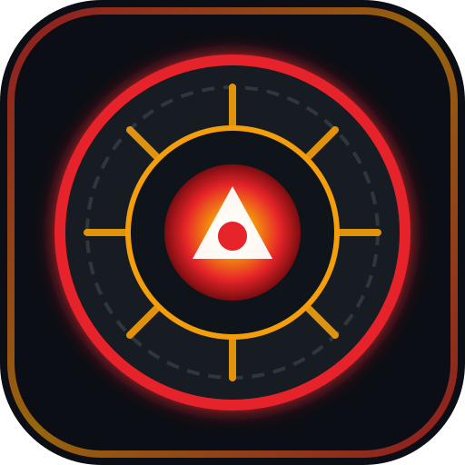

<p align="center">
  
</p>

<h1 align="center">MCU Watchlist</h1>

<p align="center">
  <strong>The Ultimate Marvel Cinematic Universe Checklist & Tracker</strong><br />
  A mobile-first, offline-capable Progressive Web Application to track your journey through Phases 1–6+.
</p>

<p align="center">
  
  
  
  
</p>

---

## ⚡ Key Features

- **Complete MCU Catalog**: 72 seeded entries covering Phase 1 through Phase 6 and the Multiverse Saga finale (films, Disney+ series, and classic Marvel One-Shots).
- **Dual Timeline Sorting**: Instant one-tap switch between **Release Order** and **In-Universe Chronological Order**.
- **4 Curated Watchlist Views**:
  - `All Connected`: Full Marvel Cinematic Universe canon.
  - `Films Only`: Core theatrical releases only.
  - `Disney+ Collection`: Entries available to stream on Disney+.
  - `Custom Watchlist`: Select, curate, and track your personal watchlist via the built-in editor.
- **Responsive Dynamic Cards**: Cards auto-adjust their height to fit multi-line titles without truncation (`...`), looking crisp across all screen sizes.
- **Zero Backend / Instant Offline**: All watched states, filters, and custom lists persist locally in your browser's `localStorage`.
- **Milestone Celebration**: Interactive progress bar with confetti celebrations upon hitting 100% completion.
- **Cinematic Dark Theme**: Crafted with deep slate (`#0B0E14`), Marvel crimson accents (`#E62429`), gold phase badges, and safe-area notch padding for iOS devices.

---

## 🚀 How It Works Offline

This application is built as a **100% client-side, zero-network-dependency PWA**:

1. **Embedded Static Dataset**: All metadata (titles, release dates, orders, phases, and Disney+ flags) is stored directly inside [`src/data/mcuData.ts`](./src/data/mcuData.ts). No external APIs, rate limits, or database queries.
2. **Service Worker Pre-Caching**: Configured with `vite-plugin-pwa` and Google Workbox, the service worker caches all static assets (HTML, JS, CSS, fonts, and SVG icons) upon first visit. Subsequent launches load instantly from Cache Storage—even with no internet connection.
3. **Local State Persistence**: Checklist progress is saved to browser `localStorage`. Your progress stays safe across browser closes, device reboots, and offline sessions without requiring an account.

---

## 📱 How to Install as a Progressive Web App (PWA)

### On iOS (iPhone / iPad - Safari)
1. Open **Safari** and visit your deployed URL or local network address (`http://<your-ip>:8085`).
2. Tap the **Share** button (the square with an arrow pointing upward).
3. Scroll down and tap **"Add to Home Screen"** (`➕`).
4. (Optional) Rename it to **"MCU Tracker"** and tap **Add**.
5. Tap the new Arc Reactor icon on your home screen to launch the app in **standalone fullscreen mode** (no browser bars or URL inputs).

### On Android (Chrome / Brave / Edge)
1. Open the website in **Chrome**.
2. Tap the **three dots menu** (`⋮`) in the top right.
3. Tap **"Install app"** or **"Add to Home screen"**.
4. Confirm by tapping **Install**.

### On Desktop (Chrome / Edge)
1. Open the website in Chrome or Edge.
2. Click the **Install** button located on the right side of the URL bar (or go to `Menu > Apps > Install MCU Watchlist`).

---

## 🛠️ Development & Local Setup

### Prerequisites
- [Node.js](https://nodejs.org/) (v18 or higher)
- `npm` (or `pnpm` / `yarn`)

### Getting Started
```bash
# Clone the repository
git clone https://github.com/your-username/mcu-film-checklist.git

# Navigate into project directory
cd mcu-film-checklist

# Install dependencies
npm install

# Start local development server on port 8085
npm run dev
```

The app will be available at:
- **Local**: `http://localhost:8085/`
- **Network**: `http://<your-local-ip>:8085/` (to test on mobile devices connected to the same Wi-Fi)

### Production Build
```bash
# Build production bundle with PWA service worker
npm run build

# Preview production build locally
npm run preview
```

---

## 🗂️ Tech Stack
- **Framework**: React 18 with TypeScript
- **Bundler & PWA**: Vite + `vite-plugin-pwa` (Workbox)
- **Styling**: Tailwind CSS (with iOS safe-area utilities)
- **Icons**: Lucide React + custom SVG Arc Reactor badge
- **Micro-Interactions**: Canvas Confetti

---

## ⚖️ Disclaimer

> **This is an unofficial, non-commercial fan-made project created solely for educational, personal, and entertainment purposes.**
>
> All Marvel Cinematic Universe characters, film titles, logos, trademarks, and associated media are the intellectual property of **Marvel Studios**, **The Walt Disney Company**, and their respective copyright holders. This project is not affiliated with, authorized, endorsed, or in any way officially connected with Marvel Studios, Disney, or any of their subsidiaries. No copyright infringement is intended.

---

## 📄 License

This project is open source and available under the [MIT License](./LICENSE).
